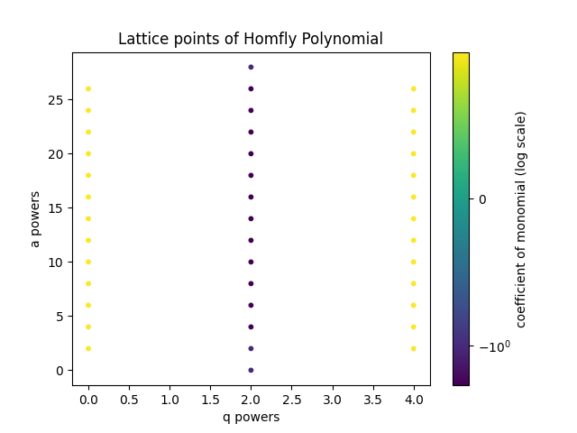
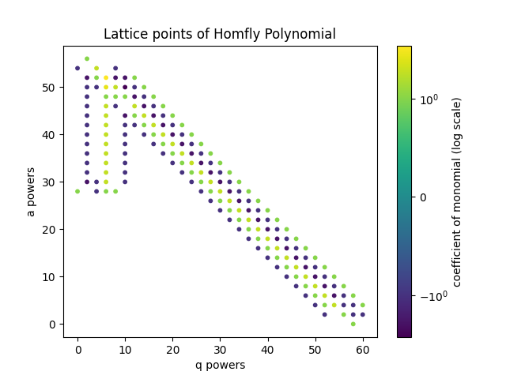
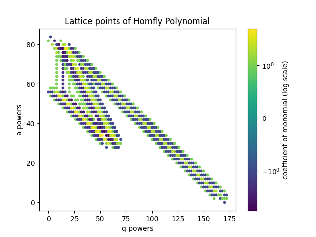
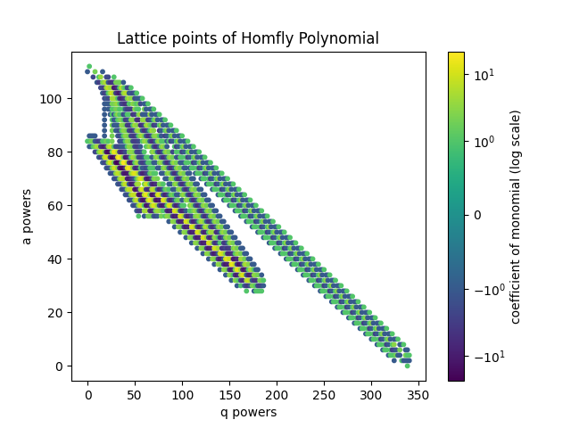
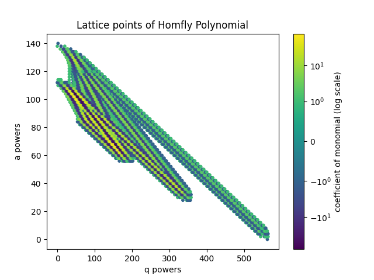
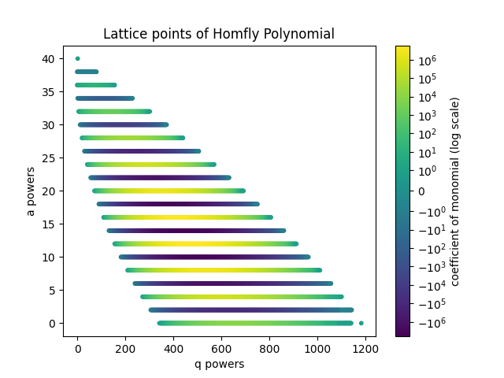
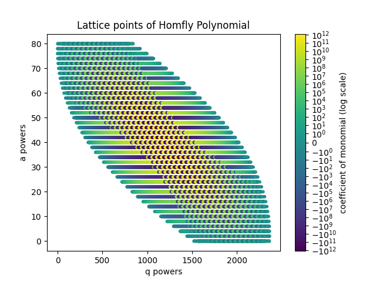

# HOMFLY-PT Lattices

Visualizations of the HOMFLY polynomial lattice.

* x axis: q powers
* y axis: a powers
* heatmap: coefficient of monomials, where orange is +1, green is -1, red is > 1, and blue is < 1

Note that we normalize by the lowest a and q powers so that it is a true polynomial.

  

    
    
 1-Colored HOMFLY-PT Polynomial of 
  \(
    K_{53/2}.
  \)

  

  

    
    
2-Colored HOMFLY-PT Polynomial of 
  \(
    K_{53/2}.
  \)

  

  

    
    
3-Colored HOMFLY-PT Polynomial of 
  \(
    K_{53/2}.
  \)

  

  

    
    
4-Colored HOMFLY-PT Polynomial of 
  \(
    K_{53/2}.
  \)

  

  

    
    
5-Colored HOMFLY-PT Polynomial of 
  \(
    K_{53/2}.
  \)

  

  

    
    
20-Colored HOMFLY-PT Polynomial of 
  \(
    K_{3/1}.
  \)

  

  

    
    
20-Colored HOMFLY-PT Polynomial of 
  \(
    K_{13/8}.
  \)

  

