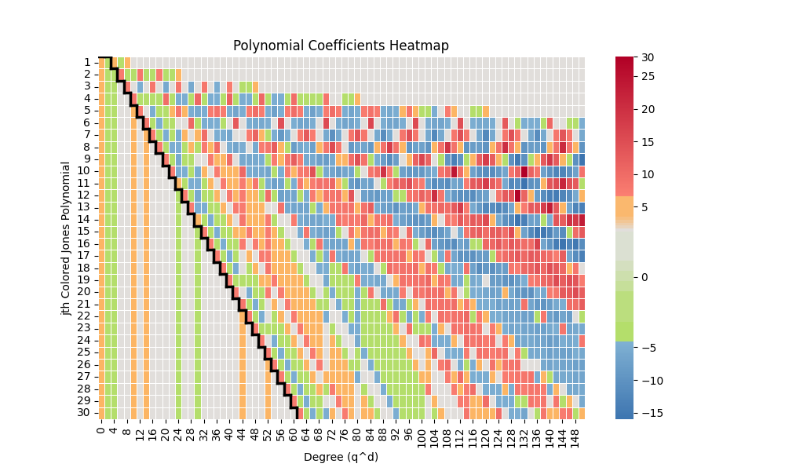
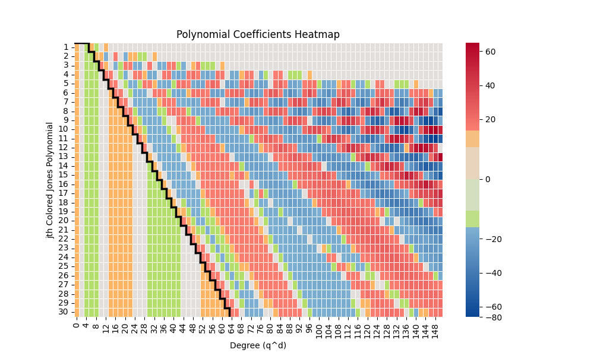
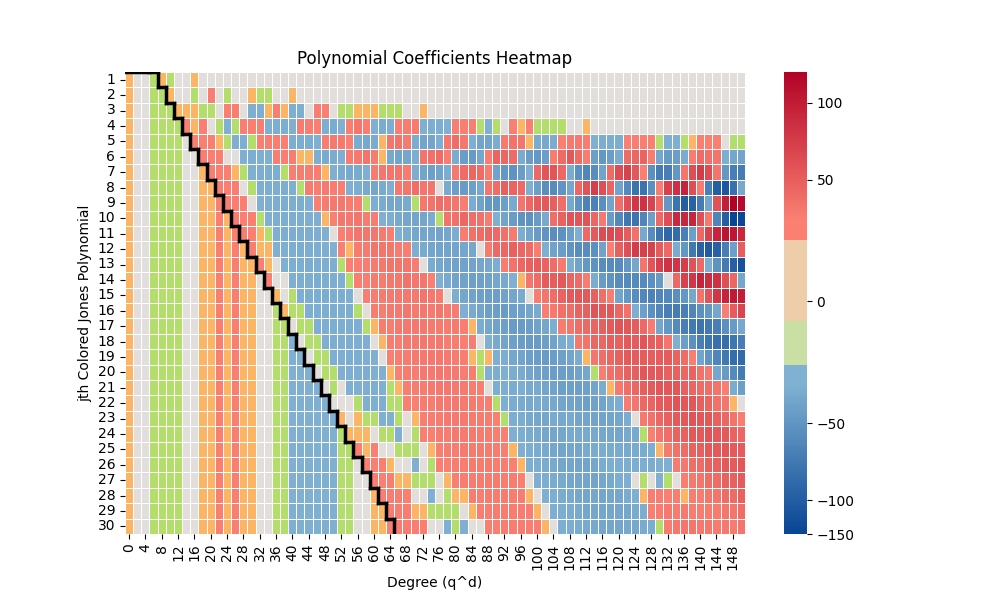
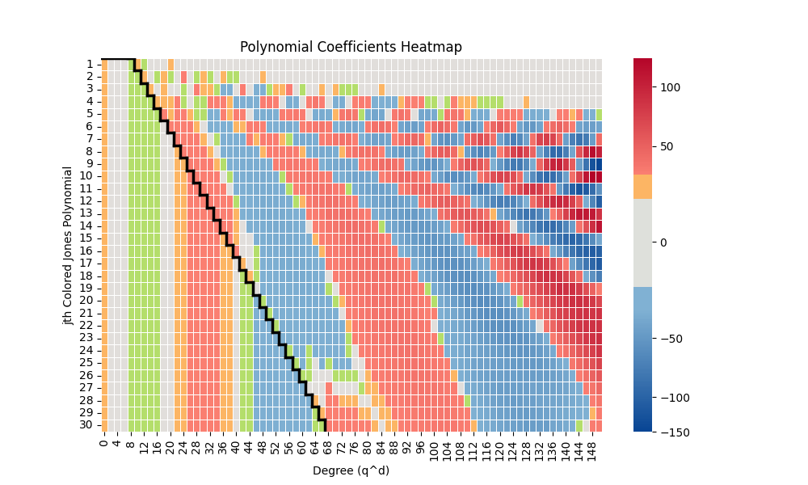
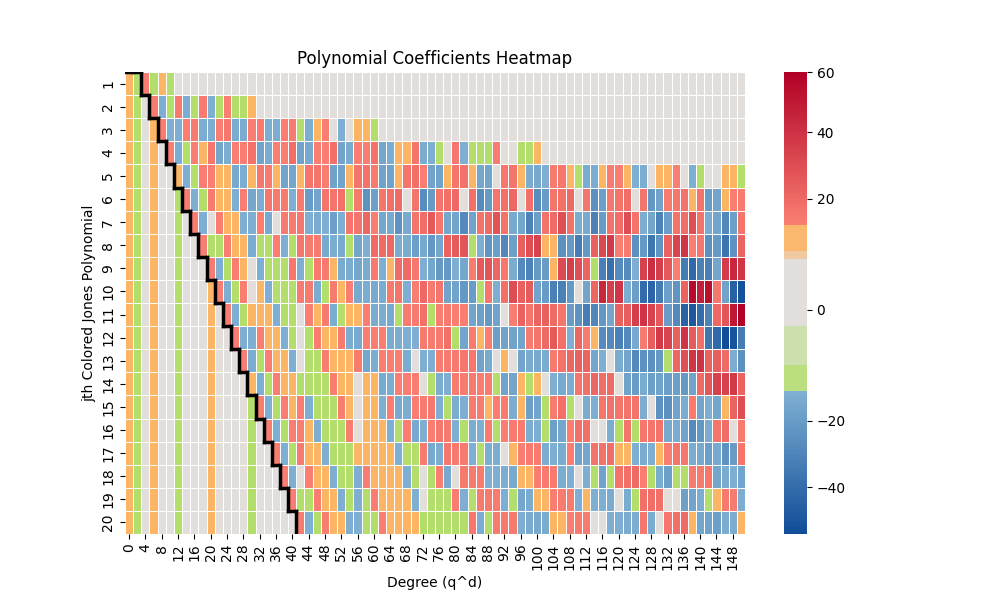
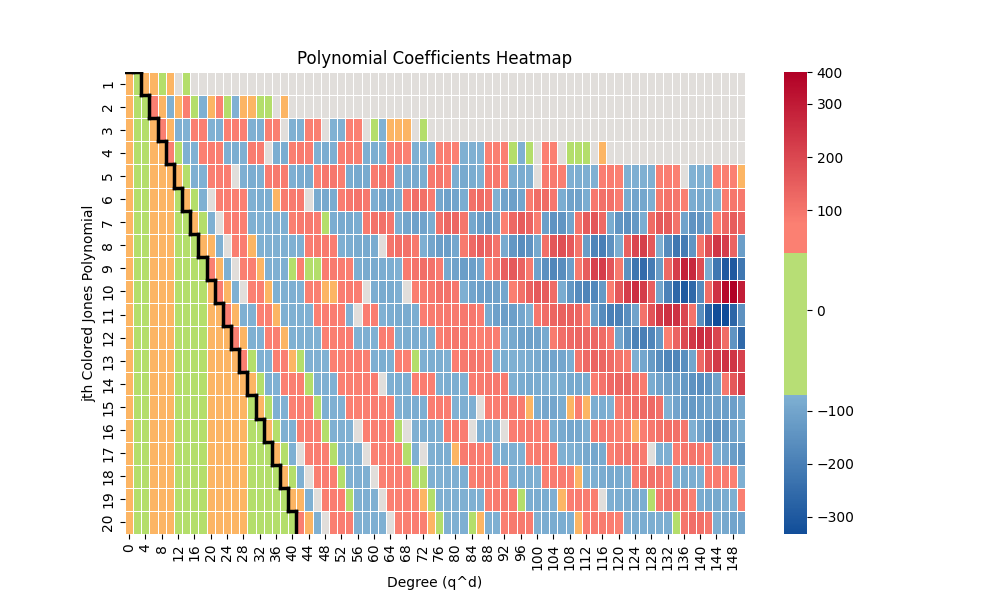

# Tail of the Jones Polynomial Heatmaps

Visualizations of the tail of the colored Jones polynomials and colored \(\mathfrak{sl}_N\) polynomials. 

* x axis: even q powers
* y axis: jth colored Jones polynomial normalized by the lowest q power and so that the constant term is positive.
* heatmap: coefficient of monomials, where orange is +1, green is -1, red is > 1, and blue is < 1

Note that because of this color scheme, the color bar is often a bit buggy. Additionally, we plot a staircase that shows the highest stable q power for each polynomial.

  

    
    
 Tail of Jones polynomial for  
  \(K_{5/2}\).

  

  

    
    
 Tail of \(\mathfrak{sl}_3\) polynomial for  
  \(K_{5/2}\).

  

  

    
    
 Tail of \(\mathfrak{sl}_4\) polynomial for  
  \(K_{5/2}\).

  

  

    
    
 Tail of \(\mathfrak{sl}_5\) polynomial for  
  \(K_{5/2}\).

  

  

    
    
 Tail of Jones polynomial for  
  \(K_{7/3}\).

  

  

    
    
 Tail of \(\mathfrak{sl}_3\) polynomial for  
  \(K_{7/3}\).

  

  

    
    
 Tail of \(\mathfrak{sl}_4\) polynomial for  
  \(K_{7/3}\).

  

  

    
    
 Tail of \(\mathfrak{sl}_5\) polynomial for  
  \(K_{7/3}\).

  

