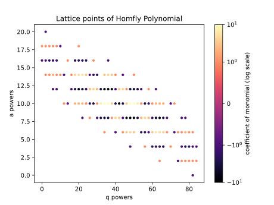
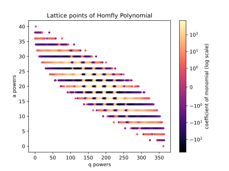

# HOMFLY-PT Quivers of Rational Knots

This program is used to compute the Homfly quiver data for a given rational knot \(K_{u/v}\). From this data, we can compute the colored HOMFLY-PT polynomials. 

## Authors:
Elijah Berry · Rongjiang Guo · Eduardo Perez · Henry Zaslow

## About

This code was written for the UIUC Summer IML project: Colored HOMFLY-PT polynomials of Rational Knots. We developed a fast algorithm to compute colored HOMFLY-PT polynomials, which then can be specialized to the colored Jones and colored \(\mathfrak{sl}_N\) polynomials. We have also implemented functions to visualize these polynomials, and how they vary with color. In particular, we visualize how tails and heads form for each of these polynomials. These polynomials are calculated by means of the [Knots-Quivers Correspondence](https://arxiv.org/abs/1707.04017) for rational knots. Thus the computation of these polynomials is reduced to calculating the quiver data of the knots. [Higgins](https://arxiv.org/abs/2603.01312) details a geometric method to calculate these quivers based on winding numbers of curves in the plane, of which we make use of in our algorithm.

## Visualizations

<figure style="text-align: center;">
  
  <figcaption>Figure 1. The 5th-Colored HOMFLY-PT Polynomial of 
  \(
    K_{5/2}.
  \)
  </figcaption>
</figure>

<figure style="text-align: center;">
  
  <figcaption>Figure 2. The 10th-Colored HOMFLY-PT Polynomial of 
  \(
    K_{5/2}.
  \)
  </figcaption>
</figure>

<video controls autoplay loop muted playsinline width="700">
  <source src="videos/heatmap_evolution_se_5_2.mp4" type="video/mp4">
</video>

## Acknowledgements

This project was fully supported by NSF Grant DMS-2405302. Additionally, we would like to thank Jonathan Higgins and Jake Rasmussen for leading this project and for their support.

## Pages

* [Read the tutorial](tutorial.md)
* [Github Repository](https://github.com/epberry2/su26-knots)
* [List of Quivers](assets/files/table.txt)
* [Bibliography](bibliography.md)

