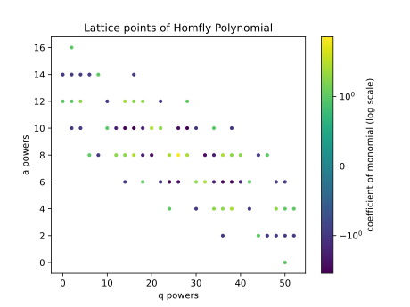

# Getting Started

This python library lets users compute and visualize colored HOMFLY-PT polynomials of rational knots.

---

## Clone the repository

```bash
git clone https://github.com/epberry/su26-knots.git
cd su26-knots
```

Install the dependencies.

```bash
pip install -r requirements.txt
```

---

## Examples

Here is a quick example to show how to compute and visualize these polynomials:

```python
from quivers.evaluate_quiver import colored_homfly_polynomial
from visualizers.visualize import visualize_lattice

# Get the 4th colored HOMFLY-PT polynomial of the knot K_{5/2}
homfly_poly = colored_homfly_polynomial(5,2,4) # saves polynomial as a sympy Poly object

print(homfly_poly.as_expr()) # print polynomial as a sympy expression
visualize_lattice(homfly_poly, path=f"Knot_5_2_4", show_plot=False, log_scale=True, cols="viridis") # plot the a and q powers on a lattice
```

Running this should print the following polynomial:

```bash
a**16*q**2 - a**14*q**16 + a**14*q**8 - a**14*q**6 - a**14*q**4 - a**14*q**2 - a**14 + a**12*q**28 - a**12*q**22 + 2*a**12*q**18 + 2*a**12*q**16 + 3*a**12*q**14 - a**12*q**10 + 2*a**12*q**4 + a**12*q**2 + a**12 - a**10*q**38 + a**10*q**34 - a**10*q**30 - 4*a**10*q**28 - 3*a**10*q**26 + 2*a**10*q**22 + 3*a**10*q**20 - 2*a**10*q**18 - 4*a**10*q**16 - 4*a**10*q**14 - 2*a**10*q**12 + a**10*q**10 - a**10*q**4 - a**10*q**2 + a**8*q**46 - a**8*q**44 + 2*a**8*q**40 + 2*a**8*q**38 + 3*a**8*q**36 - 2*a**8*q**34 - 3*a**8*q**32 + 3*a**8*q**28 + 9*a**8*q**26 + 3*a**8*q**24 - 3*a**8*q**20 - 2*a**8*q**18 + 3*a**8*q**16 + 2*a**8*q**14 + 2*a**8*q**12 - a**8*q**8 + a**8*q**6 - a**6*q**50 - a**6*q**48 + a**6*q**42 - 2*a**6*q**40 - 4*a**6*q**38 - 4*a**6*q**36 - 2*a**6*q**34 + 3*a**6*q**32 + 2*a**6*q**30 - 3*a**6*q**26 - 4*a**6*q**24 - a**6*q**22 + a**6*q**18 - a**6*q**14 + a**4*q**52 + a**4*q**50 + 2*a**4*q**48 - a**4*q**42 + 3*a**4*q**38 + 2*a**4*q**36 + 2*a**4*q**34 - a**4*q**30 + a**4*q**24 - a**2*q**52 - a**2*q**50 - a**2*q**48 - a**2*q**46 + a**2*q**44 - a**2*q**36 + q**50
```

and save to your directory the following image:



If you wanted to compute the quiver data for a knot, you could do so as follows:

```python
import sympy as sp
from quivers.knot_quiver import colored_homfly_vectors_and_quiver

# compute quiver data for K_{5/2}
S, A, Q = colored_homfly_vectors_and_quiver(5,2) # saves S, A as lists, Q as a sympy matrix

print(S)
print(A)
sp.pprint(Q)
```

This will print out:

```bash
[-1, 0, 1, -2, -3]
[-1, -1, 1, -1, -3]
⎡1  1  0   0   1⎤
⎢               ⎥
⎢1  2  0   0   2⎥
⎢               ⎥
⎢0  0  -1  -1  1⎥
⎢               ⎥
⎢0  0  -1  0   1⎥
⎢               ⎥
⎣1  2  1   1   3⎦
```

## More Info

Many of our functions use SymPy and NumPy, so if you are unfamiliar with these libraries, you can take a look at the [SymPy Documentation](https://docs.sympy.org/latest/index.html) and [NumPy Documentation](https://numpy.org/doc/stable/).

